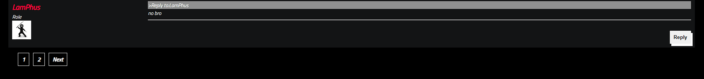

# Forum project
A forum project using java-springboot framework, html, css, javascript and mysql
## Configuration
You can config all your needed for server, datasource in application.yml
### Sever configuration

You can cofig your path, port in here
### Datasource configuration

You can config your application name, datasource which refer to your database server here(currently using my sql)
### Library configuration

You need to load all maven repository here in order to use the application
### Database configuration

You also need to create 3 table like this in MySQL to sync data
#### Users table

Users table will need to have corresponding fields
#### Posts table

Posts table will need to have corresponding fields
#### Comments table

Comments table will need to have corresponding fields
## How to use
## For user
### Login  

You can login into your account via this login page
### Register
 
Registering your new account (Those fields are required fields)
### Reset password

If the reset process is successful, you will receive the following message

### Forum

These are forum page with some features

Here some common features
### Post

These are forum page with some features

Here some common features
#### 1.Search post

Using search bar to get which post that you want to see

Result will be like this
#### 2.View post

This is what a post look like
##### a.Comment

A new comment will be displayed at the end of the post
##### b.Reply
Reply feature is exactly the same with comment feature but it will display like this if you reply to someone

#### 3.Create post

Enter the following two fields to create a new post

You will receive this message if you create post success
#### 4.Edit your post

You can choose 2 option (update your post or delete it)
#### 5.View your post

You can see all your posts here
### Profile
#### 1.View profile

You and the others can see your profile like this
#### 2.Edit profile
You and admin can gain permission to edit your profile via "EDIT" button(this button will not be displayed if others see your profile)

This is editing form

And this is what it looks like if you update your profile successfully

## For Admin
The admin will be granted full privileges to edit posts, edit user information, and have an additional new function of user management

### Manage feature

This page will display all the users in the database

The message wil be returned if you delete an user success

And if you delete your account, you will need to login again

